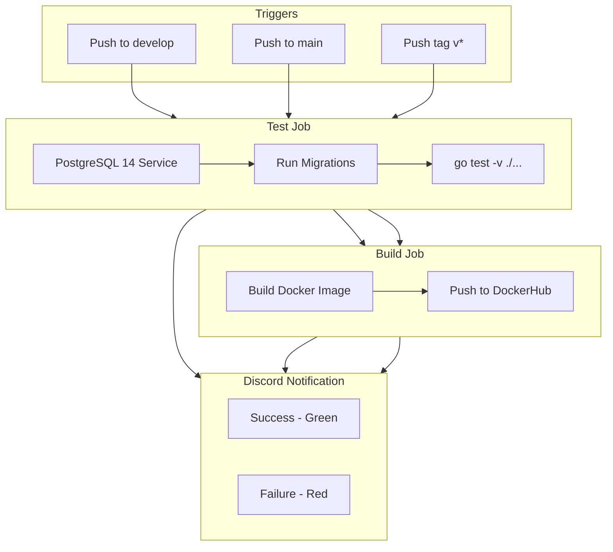

# CI/CD Workflows

## Overview

This repository uses GitHub Actions for continuous integration and deployment. There are two workflow files:

- **ci.yml** - Runs on pushes to `develop` and `main` branches
- **release.yml** - Runs on tag pushes matching `v*`

## Architecture

## Workflow Matrix

| Trigger | Test | Build | Docker Tag |
|---------|------|-------|------------|
| Push to `develop` | ✅ | ❌ | - |
| Push to `main` | ✅ | ✅ | `latest` |
| Push tag `v*` | ✅ | ✅ | tag name (e.g., `v1.0.0`) |

## Jobs

### Test Job

Runs on all triggers. Uses GitHub Actions services to spin up a PostgreSQL 14 container.

1. Checkout code
2. Set up Go (version from `vars.GO_VERSION`)
3. Download dependencies
4. Run database migrations
5. Execute `go test -v ./...`

### Build Job

Runs only on `main` branch and tags. Depends on successful test job.

1. Build Docker image from `Dockerfile`
2. Login to DockerHub
3. Push image with appropriate tag

### Notify Job

Runs after all jobs complete (success or failure). Sends Discord webhook notification with:

- Workflow name and repository
- Commit message and author
- Branch/tag name
- Status (success/failure)

## Required Configuration

### GitHub Secrets

| Secret | Description |
|--------|-------------|
| `POSTGRES_DSN` | PostgreSQL connection string for tests |
| `DOCKERHUB_USERNAME` | DockerHub username |
| `DOCKERHUB_PASSWORD` | DockerHub password or access token |
| `DISCORD_WEBHOOK_URL` | Discord webhook URL for notifications |

### GitHub Variables

| Variable | Description | Example |
|----------|-------------|---------|
| `GO_VERSION` | Go version to use | `1.25` |

## Setting Up

1. Go to your repository on GitHub
2. Navigate to **Settings** → **Secrets and variables** → **Actions**
3. Add the required secrets in the **Secrets** tab
4. Add the required variables in the **Variables** tab

## Docker Images

Images are pushed to DockerHub as `stakely/kuiper-signer:<tag>`:

- `stakely/kuiper-signer:latest` - Latest from `main` branch
- `stakely/kuiper-signer:v1.0.0` - Specific release version

